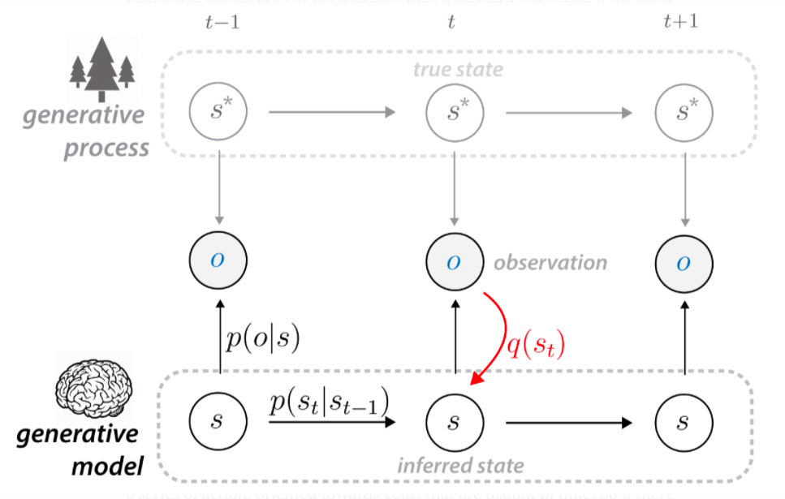
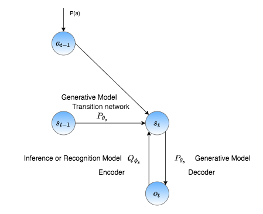
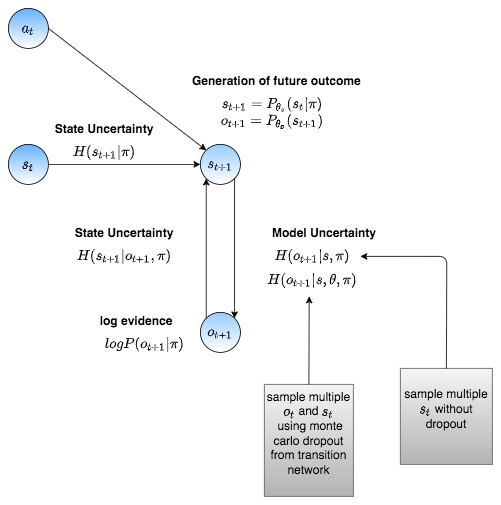
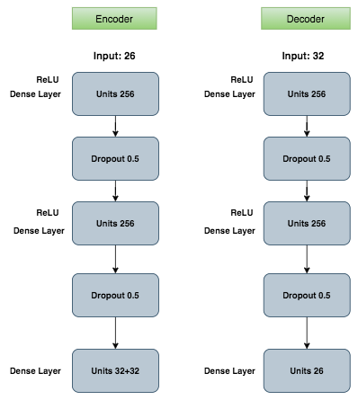
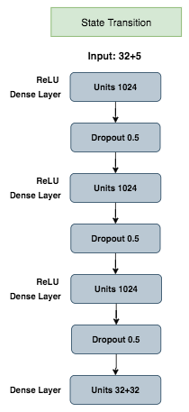
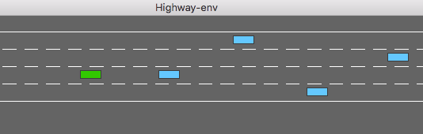
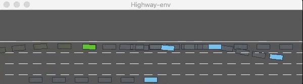
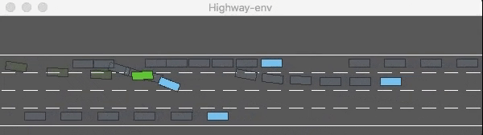
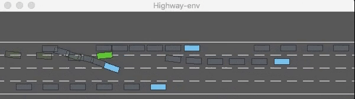
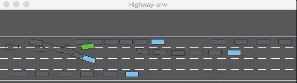

## Planning the path of self driving vehicle by predicting the future and velocities of other objects around the car using a **Generative AI** approach called Deep Active Inference

To avoid collisions, we should plan the vehicle's path by predicting the future positions of all the objects surrounding the vehicle correctly. Hence, planning and prediction are interdependent. In our approach, we solve prediction and planning through a generative AI model called Deep Active Inference. The most challenging task for an autonomous vehicle is to make decisions and plan under uncertainty. Using Active Inference, we derive state and Model uncertainty through the free-energy principle and plan by minimizing these uncertainties. Reinforcement learning agents are very popular in solving planning tasks. However, we prefer the active inference approach over reinforcement learning for it's generative ability and explainability.

The following are the research questions answered through this work:

1. Is it possible to predict the future states of the other objects in the autonomous driving environment and plan the path of the self-driving vehicle using a generative AI model called Deep Active Inference?
2. What is the possibility to derive uncertainty-based estimators for prediction and planning in autonomous driving?
3. Is it possible to increase the performance of a Deep Active Inference Model using temporal ensemble?

## Generative AI Model

The generative model is learned by estimating the distributions of hidden states P(s) and the posterior, P(s|o). The probability of the observed data P(o) is called the model evidence which quantifies how good are the predictions of the model. To receive higher values of model evidence P(o), we should choose our model parameters accordingly. Hence, maximizing the model evidence is simply minimising the surprise in terms of active inference . Surprise is mathematically represented as -log P(o). 

    
    

# Generative AI Model Architecture

## Encoder- Decoder Network Architecture

## State Transition 

## Optuna Hyperparameter Optimization

We have used **Optuna hyperparameter optimization** technique for choosing the right parameters for the model.
This technique is well known for easy parallelization and uses state-of-the-art algorithms like grid search, random search for sampling hyperparameters. The first step is to define set of hyperparameters that we want to tune with the ranges. The second step is to define an objective function that can be minimized or maximized by performing multiple trials with different set of hyperparameter values at each trial. We can define the number of trials to be performed. 

We have experimented with two objective functions: one to maximize the total reward and the other is to minimize the mean squared error of the predictions. We have performed multiple trials starting from 100 to 2000 to understand the behavior of hyperparameters over the model. After a successful iteration of the number of trials specified, Optuna suggests the optimal values for all the hyperparameters defined based on these trials. 

Through optuna optimization, we got an approximate estimation of behavior of different hyperparameters and selected the values mentioned in the following tables. We performed experiments with batch sizes 16 and 32 and inferred that the model trained with batch size 16 shows a stable increase in the reward.

### Hyperparameters

| Hyperparameters               |                      |
| ----------------------------- | -------------------- |
| batchsize                     | 16                   |
| learningrate - transition network | 0.001            |
| learningrate - reconstruction network | 0.0005        |
| beta-s                        | 10                   |
| samples(N)                    | 10                   |

### Transition Network

| Transition Network           |                      |
| ----------------------------- | -------------------- |
| No of layers                  | 3                    |
| No of units                   | 1024                 |
| Units in latent dimension     | 32                   |
| Dropout                       | 0.5                  |

### Reconstruction Network (Encoder & Decoder)

| Reconstruction Network (Encoder & Decoder)  |                      |
| ----------------------------- | -------------------- |
| No of layers                  | 2                    |
| No of units                   | 256                  |
| Dropout                       | 0.5                  |

## Dataset 

The models are trained with the highway environment. It comprises of four different lanes as shown in Figure \ref{fig:Highway-Environment} and the vehicles can appear in any of these four lanes.  

The environment outputs the observation at each time step in the form of vectors or images if given configuration type to be "kinematics" or "GrayscaleObservation" respectively. We have built the model to deal with the vector data instead of images, and the observation type is specified as "kinematics". The other configuration parameters used are as follows:

- **Vehicles\_count**: Total number of vehicles in the environment.
- **Absolute**: If configured as false, then the coordinates of other vehicles in the frame are relative to the ego vehicle while the ego vehicle stays absolute with respect to its position.
- **Simulation frequency**: The rate of updating the simulated agents and their trajectories in the simulator.
- **Policy frequency**: The frequency at which the agent can take decisions. A higher policy frequency is analogous to a short-term model as not many changes happen between the successive observations from the environment. It should always be lower than the simulation frequency.
- **Duration**: The time taken for a single episode to run.

The model trained with the following configuration with policy frequency 1 is named as **PF1** model.

- **vehicles count**: 5
- **absolute**: false
- **policy frequency**: 5
- **simulation frequency**: 15
- **duration**: 200

## Increasing Reward during training

## Prediction accuracy over unseen data for 100 episodes

| Feature       | Prediction Accuracy | Reconstruction Accuracy |
| ------------- | ------------------- | ----------------------- |
| x position    | 93.78               | 91.49                   |
| y position    | 95.80.              | 95.87.                  |
| x velocity    | 96.12.              | 95.70                   |
| y velocity    | 91.02               | 91.01                   |

# Qualitative Analysis

While evaluating the PF5 model, it has been observed that the ego vehicle learns to drive slowly and maintains an average speed of 21 m/s to avoid collisions. In the initial updates, we observed that the ego vehicle maintains an average speed of 29m/s which ends up colliding more often, achieving a total reward of 20\%. In frame 2, the ego vehicle avoids collision with the other vehicle by moving on to the first lane. 

 | 
:-------------------------:|:-------------------------:
 | 

*Figure 1: Demonstration of overtaking scene*

